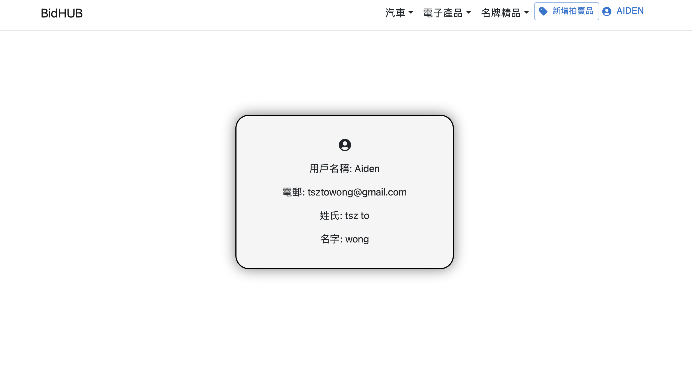

# BidHUB 拍賣網站

以下是一些主要功能和相關設定的說明：

## 功能特點

- 註冊、登入、登出
- 使用 JWT Token 保持登入狀態
- 新增拍賣品
- 顯示商品列表，可根據商品類別進行篩選
- 買家用戶可以進行投標
- 賣家可以在拍賣結束前提前結標
- 拍賣結束時會發送郵件通知得標者

## 先決條件與依賴性

確保以下套件已安裝：

- MailKit v4.3.0
- Microsoft.AspNetCore.Authentication v2.2.0
- Microsoft.AspNetCore.Authentication.JwtBearer v7.0.13
- Microsoft.AspNetCore.SpaProxy v7.0.12
- Microsoft.EntityFrameworkCore.Design v7.0.13
- Microsoft.EntityFrameworkCore.Sqlite v7.0.13
- Microsoft.IdentityModel.Tokens v7.0.3
- System.IdentityModel.Tokens.Jwt v7.0.3
- 其他前端相關套件

## 安裝與運行

1. 使用以下命令進行複製：

    ```
    git clone https://github.com/aiden1020/React-Asp.net-with-sqlite.git
    ```

2. 在 Visual Studio Code 中啟動專案，使用 Debug 模式運行。

## 配置文件

在 `appsettings.json` 中設定以下值：

```json
{
  "EmailHost": "your_email_host",
  "EmailUsername": "your_email_username",
  "EmailPassword": "your_email_password",

  "JwtSettings": {
    "Issuer":  "your_issuer", 
    "Audience": "your_audience", 
    "SignKey": "your_sign_key"
  },

  "Logging": {
      "LogLevel": {
        "Default": "Information",
        "Microsoft": "Warning",
        "Microsoft.Hosting.Lifetime": "Information"
      }
  },

  "AllowedHosts": "*"
}
```

請將 `your_email_host`、`your_email_username`、`your_email_password`、`your_issuer`、`your_audience`、`your_sign_key` 替換為實際值。

## 注意事項

請確保相關套件已安裝，並且設定文件中的值是正確的，以確保 BidHUB 拍賣網站正確運行。

## 介面
](Images/image-1.png) 
](Images/image-2.png) 
](Images/image.png) 
](<Images/Screenshot 2023-12-04 at 00.07.16.png>)
](<Images/Screenshot 2023-12-04 at 00.08.55.png>) 
](<Images/Screenshot 2023-12-04 at 00.09.27.png>) 
](<Images/Screenshot 2023-12-04 at 00.09.53.png>)